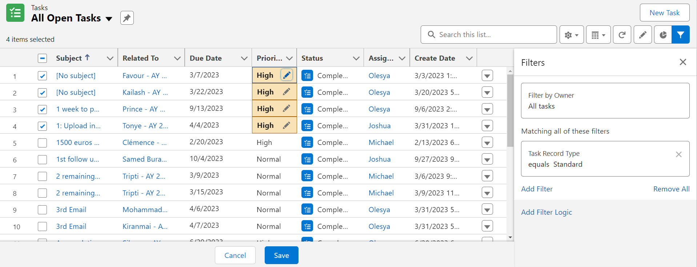

# List Views and Bulk Editing in Salesforce

## Introduction to ListViews
ListViews in Salesforce are a dynamic way to view and manage various records. They offer a user-friendly interface to search, sort, filter, and view records in a concise format. Unlike reports, ListViews provide a quicker and more straightforward approach for viewing and managing records for day-to-day operations.

### Accessing ListViews
Access ListViews by:

1. Navigating to the specific object tab (e.g., Opportunities, Contacts).
2. Selecting the desired ListView from the dropdown menu.

## Advantages of ListViews
### Overview and Management
- **Comprehensive View**: ListViews provide a holistic view of records, allowing users to understand data at a glance.
- **Search and Sort**: Although global search is available, ListViews offer a more focused search within an object. Sorting capabilities help in prioritizing and organizing records.
- **Filtering**: Users can filter records based on specific criteria, making it easier to find relevant data without creating complex reports.

### Customization and Visibility
- **Column Selection**: Users can choose which columns to display, tailoring the ListView to their specific needs.
- **Visibility**: ListViews help in assessing specific field values across multiple records simultaneously, enhancing comparative analysis.

### Bulk Editing
- **Inline Editing**: Allows users to edit a single record directly within the ListView.
- **Bulk Editing**: Users can select multiple records and apply changes to all selected records simultaneously. This feature streamlines mass updates, saving time and effort.

Requirements for Bulk Editing
- **Record Type Filter**: If the object has record types, a filter on record type is necessary for bulk editing to be enabled.
- **Field Restrictions**: Certain fields, like the record type field, cannot be edited in bulk.

### Limitations and Considerations
- **Non-Editable Fields**: Some fields may not be eligible for inline or bulk editing.
- **Bulk Editing Availability**: Not always possible in every case. Refer to this [Salesforce Help Article](https://help.salesforce.com/s/articleView?id=000384838&type=1) for detailed reasons.