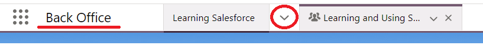

# Navigating and Understanding Salesforce

## Overview

To understand Salesforce and how it is used, we will use the analogy of Excel files in a computer, since we are all familiar with that.

## How to think about it

Think of a computer and its desktop window. In the analogy, that is Salesforce in its entirety.
- In the Desktop window, you have one folder with multiple excel files holding all information about our Admission department's activities. The folder is the Back Office app.
- In that folder, you have multiple excel files saved. Those are the different objects. Some examples of objects we use most frequently are the Interaction object, Task object, and the Opportunity object.
- In one of those excel files (now entering one object), you have the top row which shows the column names and the remaining rows below it, which show the rows of data. The top row (column names) is an object's fields, and the remaining rows of data are an object's records.

## Bringing it all together

Starting from #3 from the list, let's imagine we have an excel file called Tasks. In it, we find an excel sheet with some headers:
- Subject,
- Description,
- Assigned To,
- Status
- etc.
These headers are the Task object's fields.

Then under the headers, we can find all our tasks. Every task has a subject, an assignee, a status, and other info in addition. These rows would be the Task object's records.

Using Salesforce is a process that involves editing and saving records.

But how can you find which records to edit and save? That's what you will see below. ⬇️

## 1. Finding the Back Office app

Salesforce is accessed through apps contained within it. As a recruiter at NEC, your primary app to use is the Back Office app. That's because we (the recruiters) are at the back office of the NEC campus 😊
In order to use Salesforce as a recruiter, make sure you're on the Back Office app. You can see which app you're on by looking at what is written at the top left of your screen. See the underlined red below:

Clicking on the 9 dots to the very left opens the App Launcher. Through the App Launcher, you can navigate to the Back Office app, if you're not on it already.

## 2. Finding the object you're looking for to see its records

Clicking on the dropdown circled red above ⬆️ shows you a list of items.
- Some are lightning pages e.g. Home, Applicant Dashboards, Tasks and Follow-ups Dashboards
- and some are object pages e.g. Interactions, Opportunities, Tasks.

To go to a particular object's page, just click on the dropdown circled red above and click on the object you want in the list. If you can't find the object there, click on the App Launcher and search for it.

### Follow along

For the example, we are navigating to the Interaction object. You can follow along by navigating to it as well.

Now that we're on the Interaction object page, we should start to see some records of the Interaction object. But you might see none. That's because of your current list view.

The list view (currently Recently Viewed in the screenshot below) is your primary mechanism to filter and sort the records of that object. Going back to the analogy, you can think of the list view mechanism like Excel's filter option, like how you can filter for only certain values of a column.

Once you're on the object's page, make sure to adjust the list view by clicking on the dropdown circled red below and selecting another list view ("All")

Now that you see some records, you can start to see how the user interface (UI) slightly resembles an Excel file's UI.

## 3. Opening a record

To open any record in Salesforce, you should first navigate to its object page. In the example, we have navigated to the Interactions object page. To open any interaction record, click on its Name (underlined red below). In the example below, it is called Interaction Name on the column. Clicking on that link would take you to the record itself.

_Please note: clicking on the Contact link (underlined light purple) would take you to the Contact record related to this interaction record. The same is true for the Opportunity link (underlined yellow)._

Now, you can repeat the same process (starting from clicking on the object in the drop down in the first image) for any other object and you can find its records, edit/save them, and complete your work.

Congratulations! You've learned how to navigate Salesforce!